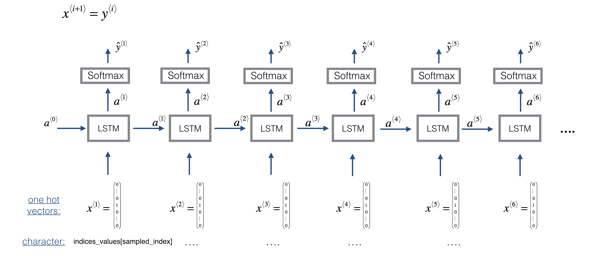

# Homework #3: Music Generation

Recurrent Neural Network(RNN) is a wildly used neural network architecture for modeling sequential data. In this homework, we will generate musical note sequences with a toy example using an RNN model. Unlike the previous homeworks, there is no evaluation process in this homework. Instead, you have to fill in the blanks in the skeleton codes. The goals of this homework are as follows:

* Experiencing the sequence generation pipeline of deep learning based system: building and training an auto-regressive model, and generating sequential data (e.g. musical notes)
* Getting familiar with the RNN architecture.

## Overview
In this home work, you will train a RNN which generate musical sequence (jazz-like sequence). We will reproduce [deepjazz](https://github.com/jisungk/deepjazz), but with some modification. Deepjazz is kinds of auto-regressive rnn model. What is auto-regressive model? Let's suppose there is a sequence, say, ```X[:5] = 0,1,2,3,4,5...```. What would be the following number? Maybe ```6```. Auto-regressive model predict next step of sequence, based on previous sequence: ```X[t] = model(X[:t-1])```. Because it can recursively generate sequence based on its own prediction, it is usually utilized for sequential data generation.
 
 In this task, we will use RNN to make auto-regressive model. Why? because it works really well. If you want to have some ideas how far simple RNN can do, I strongly recommends you to read [Karpathy's blog post](http://karpathy.github.io/2015/05/21/rnn-effectiveness/). Especially, [LSTM](https://www.bioinf.jku.at/publications/older/2604.pdf) ([explained](https://colah.github.io/posts/2015-08-Understanding-LSTMs)), and [GRU](https://arxiv.org/abs/1412.3555). Following images (from [coursera](https://www.coursera.org/learn/nlp-sequence-models/home/welcome)) shows how our model works. 

The first element music sequence ```x(1)```  is fed into LSTM. The output ```y^(1)``` is prediction of ```y(1)```, which is actually next step of the sequence ```x(2)```. Hidden state of LSTM also have to be initialized ```a(0)```. Hidden state ```a(1)``` will be fed to the next step with next input element ```x(2)```. This procedure is repeated until the sequence is ended. In this homework, the sequence is categorical, thus we will use Softmax on output layer. On each time step, output of network should be evaluated (we will use ```nn.NLLloss()```) to calculate loss function.

To generate a sequence with trained model, output of the model should be fed recursively. 

At the first step, you have to put arbitrary value to generate first value ```y^(1)```. From ```y^(1)```, you have to select a discrete index to feed into next step (remember that ```y^(t)``` is output of Softmax, thus have continuous value). We will randomly sample the index from the output of Softmax distribution.

After you generate the sequence, converter function (generate.indices_to_midi) will convert your integer sequences into midi format.

We will use [embedding layer](https://pytorch.org/docs/stable/nn.html#sparse-layers) and [NLLloss](https://pytorch.org/docs/stable/nn.html#nllloss). Thus we don't have to convert our sequence into onehot vectors.


## Dataset
We will use very tiny dataset made with only one MIDI file (data/original_metheny.mid). Instead of using musical notes directly, we will use high-level representations that encode musical features of jazz music (chord progression, beats, and so on) in the input as a dictionary. As a result, 60 integer sequences made of length of 30 are generated from the data MIDI. Each integer indicates the index of encoding dictionary. The number of dictionary is 78 (constants.N_DICT). You can check the first sequence of dataset as follow. However, you don't have to know about its meaning for this homework.
```
$ python dataloader.py
tensor([78, 18, 10, 61, 64, 41, 26, 41, 77, 32, 46, 47, 37, 38, 26, 15, 59, 48,
         3, 55, 16, 55, 74,  5, 52, 29, 67, 77, 46, 12])

```
Index==78(79th index) is a dummy, and will be only appear at the beginning of each sequence (model does not have to predict it). 

If you are curious about the encoding, you can get some hints by looking at the dictionaries (uncomment codes in dataloader). 
```
$ python dataloader.py
...
 0: C,0.250,<d1,P-5>
 1: C,0.333,<A4,d-2>
 2: A,0.250,<m2,P-4>
 3: S,0.250,<A4,d-2>
 4: S,0.333,<d1,P-5>
 5: C,0.250,<P4,m-2>
 ...
```

## Requirements 
This homework requires the following software modules. You can install them with pip.

* Python 3.7 (recommended)
* Numpy
* music21
* PyTorch 1.0
* tqdm


```
$ python -m pip install music21
$ python -m pip install tqdm
```

## Skeleton Code
The given source code is not completed yet; Your mission is to fill in the blanks, marked as "None" followed by # TODO comment.
you don't have to follow the codes, but each function should work properly.

There are bunch of codes, but you only have to consider following Python files.
* dataloader.py: loads and make dataset.
* rnn.py: make RNN model module. You have to complete "Baseline" class
* train.py: trains the model. You have to complete training iteration part.
* generate.py: generate the feature sequence with the trained model, and make a MIDI file. You 
have to complete "generate_sequence" function

After you fill in the all blanks in rnn.py and train.py, you can check it by running trian.py
You can also make your own midi file by running generate.py (change model checkpoint path with yours in \_\_main\_\_(), with your trained model).


```
$ python train.py
...

$ python generate.py
...
```

## Listening to the Music
In order to listen to the music, you should synthesize sound from the MIDI. The followings are the options on different OS platforms: 

* Windows Media player (Windows only)
* Garageband (MacOS only)
* [FluidSynth](http://www.fluidsynth.org/): software library (Windows, MacOS, Linux)
* [Timidity++](http://timidity.sourceforge.net/): software library (Windows, MacOS, Linux)


## Deliverables
* The completed source code files
* The generated MIDI file


## References
The homework was based on the following examples and we heaviliy used the existing source code.   

* [coursera homework](https://www.coursera.org/learn/nlp-sequence-models/home/welcome)
* [deepjazz](https://github.com/jisungk/deepjazz)
* [jazzml](https://github.com/evancchow/jazzml)


## Other examples
If you are interested, there are other examples you can try.

* [char-rnn](https://github.com/spro/char-rnn.pytorch): Write Shakesperare-like sentences
* [performance-rnn](https://magenta.tensorflow.org/performance-rnn) : Generating classical music midi note sequence. It was actually the 3rd homework(this!), but replaced because of huge training time.


## Credit
Thie homework was implemented by Taegyun Kwon in the KAIST Music and Audio Computing Lab.


